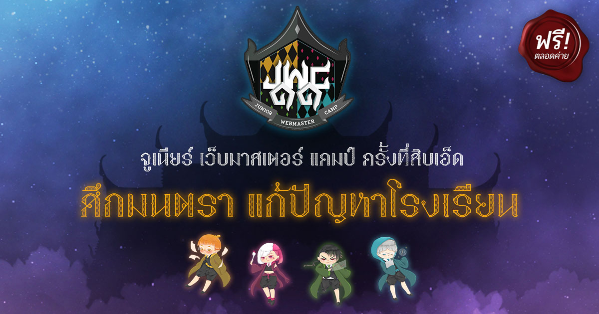

> การเดินทางขากลับคงจะเหงา

ประเดิม blog แรกด้วยรีวิวค่าย JWC ละกัน :)

ตอนแรกไม่ได้กะจะสมัครค่ายนี้ แต่มีวันนึงเห็นโพสในเฟสพอดี เป็นโพสที่พี่เติ้ลแชร์บล็อคของตัวเองมา [เมื่อจุดเปลี่ยนเดินทางมาพบกันอีกครั้ง จาก JWC7 สู่ YWC15](https://nutn0n.com/ywc-to-ywc/)

พอเข้าไปอ่าน ก็รู้สึกได้ว่ามันมีพลังที่ไม่เหมือนกับค่ายอื่นที่ได้รู้จักมา พอเป็นแบบนี้ปุ้ป ก็ตัดสินใจว่า เอาหละ สมัครเลยละกัน เลยกดสมัครสาขา Programming ไปอย่างไม่ลังเล ซึ่งตอนแรกก็ไม่ได้หวังมากเท่าใหร่ คิดว่าติดก็ได้ ไม่ติดก็ไม่เป็นไร แต่พอคุยกับพี่ภูมิก็เลยรู้สึกว่าอยากเข้าค่ายนี้มากขึ้น วันประกาศผลตอนนั้นไปเที่ยวญี่ปุ่นอยู่พอดี กำลังตามข่าวเลือกตั้งอยู่เลย ก็กดเข้าเพจไปดูเรื่อย ๆ สลับกับข่าวเลือกตั้ง จนขึ้นในเพจว่า "ประกาศแล้ว รายชื่อตัวจริงทั้ง 48 คนและตัวสำรอง!" กดเข้าไปดู พอเห็นชื่อตัวเองก็รู้สึกโล่งใจอย่างบอกไม่ถูก ยืนยันสิทธิ์ทันที

### Day 1

มาถึงวันค่ายวันแรก ตอนนั้นยังไม่รู้จักใครเลย ไม่รู้ว่าตัวเองจะเข้ากับคนอื่นได้ใหม แต่พอเข้าไปคุยด้วยเท่านั้นแหละ ไม่ถึง 1 นาที ก็เสี่ยงคุกกันเป็นที่เรียบร้อย พอบรรยายช่วงเช้าเสร็จ ก็แบ่งเข้ากลุ่มให้รู้จักกันก่อนที่จะแยกไปบรรยายตามสาขา ของสาขา Programming ก็จะเป็นการใช้เครื่องมือที่เรียกว่า "Git" ในการทำงานร่วมกัน ก็จะมี workshop เล็ก ๆ ให้ลอง

ตกเย็นมาก็มีการบรรยายเรื่อง Design Thinking และแจกโจทย์ค่าย ก่อนที่จะกินอาหารเย็นและเริ่มระดมไอเดียในโจทย์ "แก้ปัญหาโรงเรียน" ตอนแรกเปิดมาตันแบบตันมาก ๆ คิดอะไรไม่ค่อยออก ตอนแรกก็คิดว่าปัญหาของระบบที่ครูสอนไม่ทันคือวิชาที่มากเกินไป แต่พอไป consult พี่ ๆ ก็เลยกลับมาคิดใหม่ว่าจรืง ๆ แล้วคือ "ครูต้องทำงานราชการเยอะไป" แต่กว่าจะคิดออกถึงปัญหานี้ก็ปาไปเกือบตีหนึ่ง ซึ่งพี่ ๆ ทุกคนก็ทุ่มเทกับการให้คำปรึกษาน้อง ๆ ทุกคนมาก ซึ้งมากครับ ;) พอดึกมาก ๆ ละทุกคนเริ่มง่วงนอนเราทุกคนมากก็เลยแบ่งงานกัน แล้วก็แยกย้ายไปนอน

### Day 2

วันที่สอง เปิดมาตอนเช้ามีสอนเรื่องการนำเสนองาน แต่ว่าเมื่อนอนดึก ก็เลยง่วงมาก ๆ แล้วก็หลับไปตามระเบียบ หลังจากนั้นก็มีการทำ Workshop หรือโปรเจคของค่ายนั่นเอง พอสรุปงานกันอีกรอบ ก็ได้เวลาทำงานกันแล้ว โปรเจคนี้ผมเลือกที่จะใช้ React ซึ่งผมว่าคิดผิดมาก เดี๋ยวบล็อคหน้าจะอธิบายว่าทำไม พี่ ๆ ทุกคนเข้ามาให้คำแนะนำตลอดเวลา Workshop 8 ชั่วโมงเลย

มาถึงช่วงสุดท้ายของการทำ Workshop ก็ปั่นงานเต็มที่ สุดท้ายทำไม่ทัน... แต่พี่ ๆ ก็ต่อเวลาให้อีก 30นาที ขอบคุณมากครับ -^-

หลังจากนั้นก็มีการเตรียมตัวนำเสนองานในวันรุ่งขึ้น ซึ่งตอนแรกก็ไม่รู้จะพูดยังไงดี แต่พี่ ๆ และเพื่อน ๆ ในกลุ่มก็ช่วยกันดูบทพูด แบ่งบทกันแล้วก็ซ้อมพูดจนถึงตี 3 จนสุดท้ายแทบไม่ได้นอน

### Day 3

วันนี้เป็นสุดท้ายของค่ายแล้ว ซึ่งในวันนี้จะมีการนำเสนองานให้กรรมการทั้ง 5 ท่าน พี่ค่าย เพื่อน ๆ และผู้ชมใน live ดู ตอนแรกก็ตื่นเต้นมาก ๆ ลุ้นว่าตัวเองจะได้กลุ่มที่เท่าใหร่ จะแจ็คพ็อตแตกได้กลุ่มแรกมั๊ย แต่สุดท้ายก็ได้กลุ่มที่สอง ซึ่งพอพรีเซนต์งานเสร็จก็รู้สึกโล่งมาก
เหมือนสิ่งที่ทำมาตลอดสามวันเห็นผลแล้ว ซึ่งตอนแรกคิดว่าจะโดนหนักกว่านี้ แต่สุดท้ายก็ผ่านมาได้

<iframe
  src="https://www.facebook.com/plugins/post.php?href=https%3A%2F%2Fwww.facebook.com%2Fjwcth%2Fphotos%2Fpcb.2357962514221953%2F2357927100892161%2F%3Ftype%3D3%26theater&width=500&show_text=false&appId=635662720231155&height=332"
  width="500"
  height="332"
  style="border:none;overflow:hidden"
  scrolling="no"
  frameborder="0"
  allowTransparency="true"
  allow="encrypted-media"
></iframe>

หลังจากการนำเสนองานเสร็จ ต่อไปก็เป็นการประกาศรางวัล ซึ่งกลุ่มผมก็ได้รางวัล Best Imagination ไป ถึงแม้เราจะไม่ติด Top 3 แต่การที่เราได้รางวัลนี้มาก็เป็นสิ่งที่บอกว่า "ความพยายาม ไม่เคยทำร้ายซักคนที่ตั้งใจ"

### Conclusion

ค่ายนี้เป็นค่ายที่ทำให้ผมมองโลกไปในอีกมุมเลย มันสอนวิธีคิด สอนอะไรหลาย ๆ อย่างที่ไม่สามารถหาได้จากห้องเรียน ซึ่งที่มาของหัวข้อบล็อคนี้ "It was going to be a lonely trip back" ก็หมายความว่า การเดินทางกลับจากค่ายที่มีเพื่อน มีพี่ มันเหงามาก ไม่เหมือนตอนอยู่ที่ค่ายนั่นเอง

JWC ไม่ใช่แค่ค่าย แต่คือครอบครัว

> ถึงแม้งานของน้อง ๆ จะไม่ได้รางวัล แต่รางวัลของน้อง ๆ คือการที่ได้มาเข้าค่ายนี้นั่นเอง - พี่แอ๊ม

ขอบคุณนะ JWC
